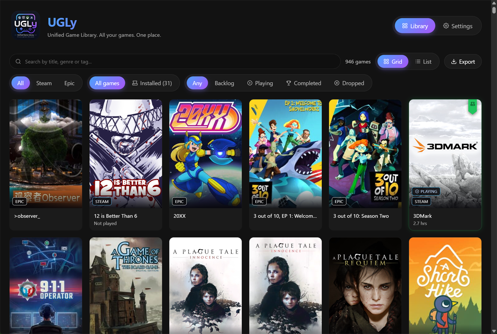
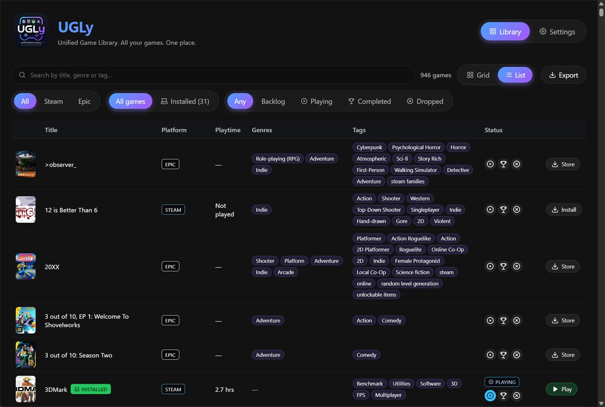
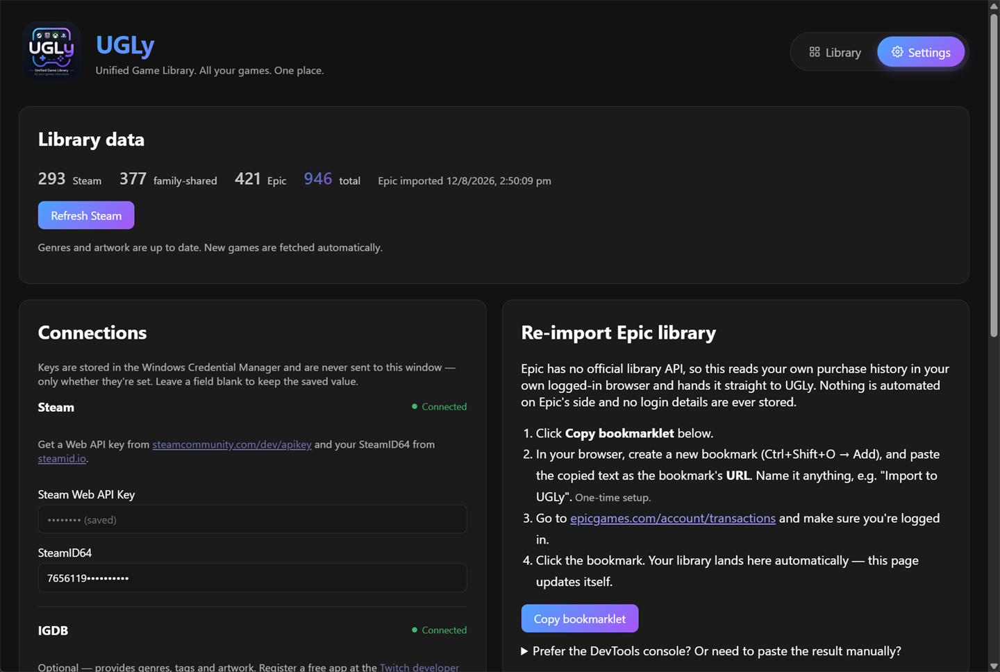

<div align="center">


# UGLy

### **U**nified **G**ame **L**ibrar**y**

**All your games. One place.**

</div>

---

## What is this?

Your games are scattered across Steam and Epic, in launchers that don't talk to each other. So
"what should I play tonight?" turns into opening both, scrolling past hundreds of titles you forgot
you owned, and giving up.

UGLy — short for **Unified Game Library** — puts your entire library in one place and lets you
search through it to find the next game you actually want to play. Everything is enriched with
genres, tags and cover art, so you can search by mood instead of memory: `roguelike`, `co-op`,
`point and click`. Games already installed are marked and launch straight from the grid.

Still can't decide? Export the whole thing to CSV and throw it at an AI to pick something based on
your mood — or connect the [built-in MCP server](#ask-an-ai-what-to-play) and just ask.

## Screenshots



<sub>Grid view — Steam, Epic and Steam Family in one place, with installed games marked.</sub>



<sub>List view — genres and tags from IGDB, with Play or Store depending on whether it's installed.</sub>



<sub>Settings — library totals, connection status, and the one-time bookmarklet setup.</sub>

## Features

- **One library** — Steam and Epic Games side by side, including Steam Family shared games
- **Search that understands you** — matches titles, genres and tags, forgives punctuation
  (`point-and-click` = `point and click` = `pointandclick`) and knows common shorthand
  (`sci-fi` → *Science fiction*, `fps` → *Shooter*, `deckbuilder` → *Card & Board Game*)
- **Installed detection** — sees what's on disk across every Steam library folder and Epic's
  manifests, with Play / Install buttons that hand off to the right launcher
- **Tags worth searching** — Steam's player-voted tags (`Souls-like`, `Metroidvania`, `Cozy`),
  topped up with genres and cover art from IGDB. Epic-only games are matched to their Steam page
  where one exists, so they get the same tags
- **Game details** — click any card for the blurb, review score, release date, developer and the
  full tag list
- **CSV export** of whatever the current filter is showing — feed it to an LLM and let it pick
- **Grid and list views**, filterable by platform or installed state
- **MCP server** so Claude, Codex or any MCP client can search your library and recommend
  something to play

## Install

Grab the latest installer from the [Releases](../../releases) page and run it. No Node, no Rust,
no terminal — it installs like any other Windows app.

> [!NOTE]
> The installer isn't code-signed, so Windows SmartScreen will show
> **"Windows protected your PC"**. Click **More info** → **Run anyway** to continue. Code signing
> certificates cost money and this is a free hobby project; the source is all here if you'd rather
> build it yourself.

## Setup

Everything below is optional until you need it — the app opens on the Settings tab if nothing is
configured yet.

### Steam

1. Get a Web API key from [steamcommunity.com/dev/apikey](https://steamcommunity.com/dev/apikey).
2. Find your SteamID64 at [steamid.io](https://steamid.io).
3. Paste both into **Settings** and save.

Your profile's game details need to be public for the API to return your library.

### Tags and artwork

**Steam tags need no setup.** UGLy reads Steam's player-voted tags for every game with a store
page — including Epic-only games, whose titles are matched to Steam once and cached. This is
batched, so the whole library takes a few seconds, and it is where the genuinely useful labels
come from: `Souls-like`, `Metroidvania`, `Bullet Hell`, `Cozy`.

**IGDB is optional** and adds genres and portrait cover art, plus tags for the games with no
Steam page at all:

1. Register a free application at the
   [Twitch developer console](https://dev.twitch.tv/console/apps).
2. Paste the Client ID and Client Secret into **Settings**.

Lookups then happen on their own in the background, one game at a time, with live progress.
Results are cached, so only genuinely new titles cost a request.

### Epic Games

Epic publishes no API for your library, and the reverse-engineered launcher OAuth flow other tools
use carries a real risk of account action — so UGLy doesn't touch it. Instead it reads your own
purchase history from your own logged-in browser session:

1. In **Settings**, click **Copy bookmarklet** under *Connect Epic*.
2. Create a browser bookmark and paste the copied text as its **URL** (one-time setup).
3. Visit [epicgames.com/account/transactions](https://www.epicgames.com/account/transactions),
   logged in.
4. Click the bookmark. Your library lands in UGLy automatically.

Refunded orders, games gifted to other people, and Unreal Engine Marketplace/Fab assets are all
filtered out.

### Steam Family shared games — optional

Steam's official API only returns games your own account owns, so family-shared titles need a
second bookmarklet that reads a short-lived session token. Same flow: copy it from **Settings**,
save it as a bookmark, then click it while logged in at
[store.steampowered.com](https://store.steampowered.com). The token is used once and never stored.

## Ask an AI what to play

UGLy ships a small [MCP](https://modelcontextprotocol.io) server, so an assistant can read your
library and answer the question the app exists to solve:

> *"I've got about two hours and I want something atmospheric I can finish in one sitting. What's
> installed that fits?"*

Open **Settings → Ask an AI what to play** and press **Copy config** — it fills in the path to the
bundled `ugly-mcp` binary for you. Paste it into your MCP client and restart it.

<details>
<summary>Configuring it by hand</summary>

For Claude Desktop, add this to `claude_desktop_config.json`:

```json
{
  "mcpServers": {
    "ugly": {
      "command": "C:\\Users\\you\\AppData\\Local\\UGLy\\ugly-mcp.exe",
      "args": []
    }
  }
}
```

For Claude Code:

```bash
claude mcp add ugly -- "C:\Users\you\AppData\Local\UGLy\ugly-mcp.exe"
```

The path depends on where you installed UGLy; the Settings panel shows the real one. The server
finds the database on its own — if yours lives somewhere unusual, point `UGLY_DATA_DIR` at the
folder containing `ugly.db`.

</details>

### What it can do

| Tool | Purpose |
|---|---|
| `get_library_stats` | Totals per store, play states, install count, playtime, and the genres and tags actually present |
| `list_games` | Search and filter by title, genre, tag, platform, play status or installed state |
| `get_game` | Details for one game |
| `set_game_status` | Mark a game as playing, completed or dropped, or return it to the backlog |

**It cannot launch or install anything.** Starting programs stays a button you press yourself. The
only thing it can change is a game's play status, which shows up in the app immediately.

The server talks over stdio and is started by your MCP client, not by UGLy — it reads the same
local database and sends nothing anywhere.

## Build from source

Requires [Node.js](https://nodejs.org) (build-time only) and the [Rust toolchain](https://rustup.rs).
On Windows you also need the MSVC build tools, which ship with Visual Studio.

```bash
npm install
npm run install:all
npm run tauri:dev
```

To produce an installer of your own:

```bash
npm run tauri:build
```

Output lands in `target/release/bundle/`. That command builds the MCP server first and stages it as
a sidecar so the installer carries it; to build just that binary, run `npm run build:mcp`.

To work on the UI in a normal browser with sample data (no Tauri, no real library):

```bash
VITE_UI_FIXTURE=1 npm run dev --prefix client
```

## Your data stays yours

- **Credentials** live in the **Windows Credential Manager**, encrypted per user. They're read
  only inside the Rust backend and are *never* sent to the app's UI — the interface only learns
  whether a key is set, never its value.
- **Your library** lives in a local SQLite database at `%APPDATA%\com.ugly.library\ugly.db`.
- **Nothing is uploaded anywhere.** The only outbound requests are to Steam, Epic and IGDB, made
  directly from your machine.
- The Epic and Steam Family imports run in *your* browser using *your* existing session. No
  passwords are entered into UGLy, and no long-lived tokens are stored.
- **The MCP server is opt-in.** It only runs if you add it to an MCP client's config, and it only
  ever touches the local database — it has no access to your credentials. Bear in mind that
  whichever assistant you connect will see your library, so it goes wherever that client's data
  goes.

## How it works

| Layer | Tech |
|---|---|
| UI | React + Vite, rendered in the system webview |
| Backend | Rust, exposed to the UI as Tauri commands |
| Storage | SQLite (`rusqlite`) |
| Credentials | Windows Credential Manager |
| Imports | A small local HTTP listener on port `43117` that the bookmarklets post to |
| Tags | Steam's public store endpoints (no API key), plus IGDB via a Twitch app |
| MCP server | A separate stdio binary (`rmcp`), started by your MCP client |

The Rust code is a Cargo workspace: `crates/core` holds the data layer, `crates/mcp` is the MCP
server, and `src-tauri` is the desktop app. Core carries no Tauri dependency, which is what lets
the MCP server link it without dragging in a window.

The shipped app contains no JavaScript runtime — Node is only used to build the frontend, which is
why the installer is a few megabytes rather than a few hundred.

## Known limitations

- **Windows only** for now. The launcher integration and credential storage are Windows-specific.
- **Imports are snapshots, not live syncs.** Re-run a bookmarklet when you want to refresh.
- **Downloads can't be paused or cancelled from UGLy** — it hands off to Steam or Epic, which own
  the download entirely.
- **Epic install** opens the game's store page in the Epic launcher, because Epic exposes no
  install action for a game you don't already own locally.
- **Metadata matching is by title**, so demos, playtests and bundled tools often won't resolve to
  a record and simply show no genres or tags.
- **Epic titles are only matched to Steam on an exact name match**, edition suffixes aside. That
  is deliberate: Steam's top result for a game it doesn't carry is frequently the sequel, and a
  wrong match would silently attach another game's tags. Some games are missed as a result.
- **Steam tags are player-voted**, so a handful of joke tags exist. Only the most-voted ones per
  game are kept, which filters out nearly all of it.

## Contributing

Issues and pull requests are welcome. This started as a personal itch, so expect rough edges.

## License

[MIT](LICENSE) — do whatever you like with it.
